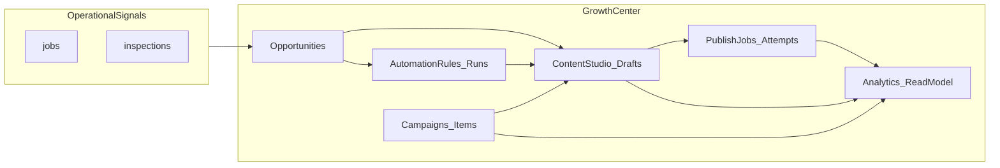

# WizField Growth Center — Source of Truth (Canonical Current State)

**Document status:** Canonical implementation truth (code-aligned)  
**Module shell:** authenticated `/marketing` route family (`frontend/app/marketing/[[...slug]]`)  
**Backend module:** [`backend/src/marketing`](../backend/src/marketing/)  
**Strategic framing:** For product thesis and roadmap narrative, retain [`WizField_Growth_Center_Marketing_Master_Plan.md`](WizField_Growth_Center_Marketing_Master_Plan.md) as non-canonical strategy input; resolve conflicts **in favor of this document**.

**Program scope:** Growth Center Phases **1–7** are **implemented and shipped** as a single coherent Growth Center (`growth_center_v1_program_complete`). This document replaces per-phase Execution Prompts and Feature Cards for day-to-day truth.

---

## 1. Identity and positioning

Growth Center is **organization-scoped** marketing operations inside WizField: marketing profile, multi-platform draft composition, optional calendar metadata, OAuth-backed channel targets, explicit publish jobs, CRM-derived opportunities, campaign shells with slot coverage, V1 opportunity-triggered automations (no auto-publish), and **internal** analytics (no ROI or ad dashboards).

**North-star constraint:** Outbound publishing is always **explicit** (`publish_job` with UTC `scheduled_at` or publish-now). Draft `scheduled_at` is **metadata only** and never silently posts.

---

## 2. In-scope vs out-of-scope (as implemented)

### In scope (landed)

- Session-authenticated **Marketing office** roles: `owner`, `admin`, `office_admin`, `dispatcher` (read breadth varies; see §7).
- Tenancy: **only** `actor.organization_id` from session; no client-supplied org id.
- Full route family (§4) with interactive panels (not placeholders).
- Live SQL aggregates for analytics; **no** marketing analytics snapshot tables or Phase 7 migrations.

### Explicitly out of scope (not product bugs)

- **Instagram outbound publishing** (V1.5 deferral); IG copy **variants** may exist as seeded studio tracks.
- **Growth Center monetization / plan entitlements** at runtime (`EntitlementService` and Stripe capability gates are **not** wired into `backend/src/marketing`). Commercial packaging is future architecture only.
- **AI copy generation runtime** inside Growth Center.
- **Warehouse / nightly marketing analytics rollup** infra.
- **Provider engagement metrics** (reach, impressions, clicks) unless later persisted intentionally.
- **SEO / Website Content Engine** (separate initiative if pursued).

---

## 3. Product map — capabilities by phase (rolled up)

| Layer | Delivery | Primary surfaces |
|--------|-----------|------------------|
| **Foundation** | Phase 1 | Auth-gated `/marketing`, shell entry, organizational context |
| **Content Studio** | Phase 2 | Settings (Marketing Profile), Create (drafts + variants), Calendar (metadata grid) |
| **Publishing integrations** | Phase 3 | Channels (Google + Meta OAuth), publish jobs / attempts / retry, executor + dispatcher |
| **CRM Intelligence** | Phase 4 | Opportunities (detectors, dedupe, convert-to-draft lifecycle) |
| **Campaign Builder** | Phase 5 | Campaigns, items, attach/detach drafts, terminal status rules |
| **Automations V1** | Phase 6 | Rules + runs, suggest-only / auto-create draft **only**, preview, idempotent runs |
| **Analytics** | Phase 7 | `GET …/analytics/summary`, `/marketing/analytics` panel, overview pulse |

### End-to-end flow (conceptual)

---

## 4. Routes and UX (canonical)

Single Next.js entry: [`frontend/app/marketing/[[...slug]]/page.tsx`](../frontend/app/marketing/[[...slug]]/page.tsx). Allowed slugs resolve to workspace route keys:

| Route | Purpose |
|--------|---------|
| `/marketing` | Overview + foundation metrics + analytics pulse strip |
| `/marketing/settings` | Marketing Profile CRUD panels |
| `/marketing/create` | Content Studio composer (`?draft=` deep link) |
| `/marketing/calendar` | UTC month grid from calendar API |
| `/marketing/channels` | Connected targets + OAuth (owners/admins connect) |
| `/marketing/opportunities` | List/detail; publisher mutations for refresh/dismiss/archive/convert |
| `/marketing/campaigns` | Campaign CRUD pattern; dispatcher read-only on mutations via API guards |
| `/marketing/automations` | Rules + runs; mutations gated like campaigns |
| `/marketing/analytics` | Bounded-window internal analytics |

**Copy rule:** Educational “later phase” rails must match **current** deferrals only (Instagram V1.5, scheduled automation triggers, exports, etc.) — not re-litigate shipped OAuth, publishing, campaigns, or automations.

---

## 5. Backend API domains (canonical map)

Base pattern: **`SessionGuard`** + [`requireMarketingOfficeActor`](../backend/src/marketing/marketing-access.ts); org id from actor.

| Domain | Controller / prefix | Notes |
|--------|----------------------|--------|
| Foundation, profile, drafts, calendar, opportunities (core CRUD) | [`MarketingController`](../backend/src/marketing/marketing.controller.ts) `@Controller("api/marketing")` | Publishing refresh/converts use [`assertMarketingPublisher`](../backend/src/marketing/marketing-access.ts) |
| Channels + OAuth mutations | [`MarketingChannelsController`](../backend/src/marketing/marketing-channels.controller.ts) `api/marketing/channels` | [`assertMarketingChannelAdmin`](../backend/src/marketing/marketing-access.ts) for connect/disconnect |
| OAuth callbacks (public) | [`MarketingOAuthPublicController`](../backend/src/marketing/marketing-oauth-public.controller.ts) `api/marketing/oauth` | Provider redirects only |
| Publishing | [`MarketingPublishController`](../backend/src/marketing/marketing-publish.controller.ts) `api/marketing` | Mutations: `assertMarketingPublisher` |
| Campaigns | [`MarketingCampaignController`](../backend/src/marketing/marketing-campaign.controller.ts) | Writes: publisher |
| Automations | [`MarketingAutomationController`](../backend/src/marketing/marketing-automation.controller.ts) | Writes: publisher |
| Analytics | [`MarketingAnalyticsController`](../backend/src/marketing/marketing-analytics.controller.ts) `GET analytics/summary` | Read: full office role set including dispatcher |

**Naming hygiene:** Legacy product **`/automations`** (inventory/pricebook automation, `EntitlementService.requireAutomationsEntitled`) is **not** Growth Center **`/marketing/automation-rules`**. Do not conflate in entitlements or support docs.

---

## 6. Data model (tables and intent)

All tables are **`organization_id` scoped** (plus user stamps where applicable). Verified in schema manifest and TypeORM config.

| Table / entity | Role |
|----------------|------|
| `marketing_profiles` | One profile row per org (JSON fragments) |
| `marketing_connected_channels` | OAuth targets, health fields, **not** downstream engagement |
| `marketing_oauth_states` | Ephemeral OAuth state |
| `marketing_content_drafts` | Drafts + `workflow_state`; **no** persisted `source` enum |
| `marketing_content_variants` | Per-platform body (GBP, Facebook, Instagram seed) |
| `marketing_opportunities` | CRM suggestions, lifecycle timestamps, `converted_draft_id` |
| `marketing_campaigns` / `marketing_campaign_items` | Plans + slots; optional `draft_id` |
| `marketing_automation_rules` / `marketing_automation_runs` | V1 rules + persisted outcomes (**cooldown skips may not persist a row**) |
| `marketing_publish_jobs` / `marketing_publish_attempts` | Explicit publishing; attempt-level HTTP outcome **not** reach metrics |

**Migrations (Growth Center rollout):** `177874…` Phase 2 → `177880…` Phase 6. **Phase 7** added **no** migration (read-only analytics).

**Indexes / FKs:** Declared in [`schema-manifest.ts`](../backend/src/database/schema-manifest.ts); keep manifest parity when altering marketing DDL.

---

## 7. RBAC and tenant safety (final policy)

| Capability | Policy |
|------------|--------|
| Enter `/marketing` | `isMarketingOfficeRole` |
| Channel OAuth connect/disconnect | Owner or **admin** only |
| Publish enqueue, cancel, retry, list jobs | Owner, admin, **office_admin** (not dispatcher) |
| Opportunity refresh / dismiss / archive / convert | Publisher roles (not dispatcher) |
| Campaign / automation mutations | Publisher roles |
| Draft create/edit/transition | **Office role** (including dispatcher) unless product revokes — **copy** in foundation `protectedBoundaries` lists dispatcher limits for **publishing, opportunities refresh, campaigns**; treat Content Studio write as intentionally broader **unless** product specs otherwise |
| Analytics API + panel | All office roles including **dispatcher** (read) |
| Org id | Never from client query/body for scope |

**Client trust:** All marketing queries filter by session org; marketing APIs do not accept alternate `organization_id` for switching context.

---

## 8. Workflow coherence (handoffs)

1. **Opportunity → Draft:** `convert-draft` creates draft + links `converted_draft_id`; warm refresh may run on read for publishers only.
2. **Draft → Review → Approved:** `workflow_state` transitions via transition endpoint; not full audit trail.
3. **Draft → Campaign:** Campaign items attach/detach `draft_id`; unique `(organization_id, draft_id)` on items prevents double attach within org.
4. **Draft → Publish:** explicit `publish-now` / `publish-schedule`; jobs reference `draft_id`.
5. **Automation → Draft:** runs with `outcome = draft_created` link `marketing_content_draft_id`.
6. **Analytics:** reads all of the above with bounded windows and explicit disclaimers (internal funnel only).

**Clock discipline:** Three clocks remain distinct: draft metadata `scheduled_at`, `publish_job.scheduled_at` (UTC), provider-native displays.

---

## 9. Analytics (Phase 7) — truth contract

- **Endpoint:** `GET /api/marketing/analytics/summary?preset=…` or `from`+`to` (UTC custom, max span ~366d).
- **Semantics:** Mix of `created_at` windows, timestamped lifecycle fields, and **approximate** funnel ratios — all labeled in payload disclaimers / funnel notes.
- **Overview pulse:** Rolling last-30d terminal publish jobs + approximate converted opportunities on foundation payload.

---

## 10. Billing and monetization stance

Growth Center capabilities today are **RBAC-derived** from foundation (`can_manage_channels`, `can_enqueue_publishing`, etc.), **not** from `OrganizationBillingService` or Stripe SKUs.

Future monetization options (bundled vs add-on vs hybrid) remain **architecture-only** until explicitly implemented.

---

## 11. Deferred / future scope (explicit)

- Instagram publishing V1.5 + media primitives.
- Scheduled / scanner automation triggers beyond opportunity-facing V1.
- Selective auto-publish after review maturity (**not** V1).
- Growth Center entitlement gates (`plan_key` / `billing_status` capability matrix).
- Analytics export / materialized rollups if scale demands.
- Deeper draft provenance (transition audit table) if needed.

---

## 12. File index (implementation truth)

| Area | Path |
|------|------|
| Marketing Nest module | [`backend/src/marketing/`](../backend/src/marketing/) |
| Marketing entities | [`backend/src/database/entities/marketing-*.entity.ts`](../backend/src/database/entities/) |
| Client API helpers | [`frontend/lib/marketing/client-marketing.ts`](../frontend/lib/marketing/client-marketing.ts) |
| Workspace UI | [`frontend/components/marketing/`](../frontend/components/marketing/) |

---

## 13. Document hierarchy

| Document | Role |
|----------|------|
| **This file** | Canonical **current-state** for Engineering / Support / PM handoff |
| Master plan | Long-horizon strategy; subordinate where it conflicts with shipped truth |
| [`WizField_Growth_Center_Closeout_and_Verification.md`](WizField_Growth_Center_Closeout_and_Verification.md) | Program closure, commits, verification gates |
| Archived / uncommitted phase prompts (if any) | Historical; **do not** treat as specification unless re-opened |

---

*Last aligned to Growth Center program completion: Growth Center Phases 1–7 (analytics shipped).*
